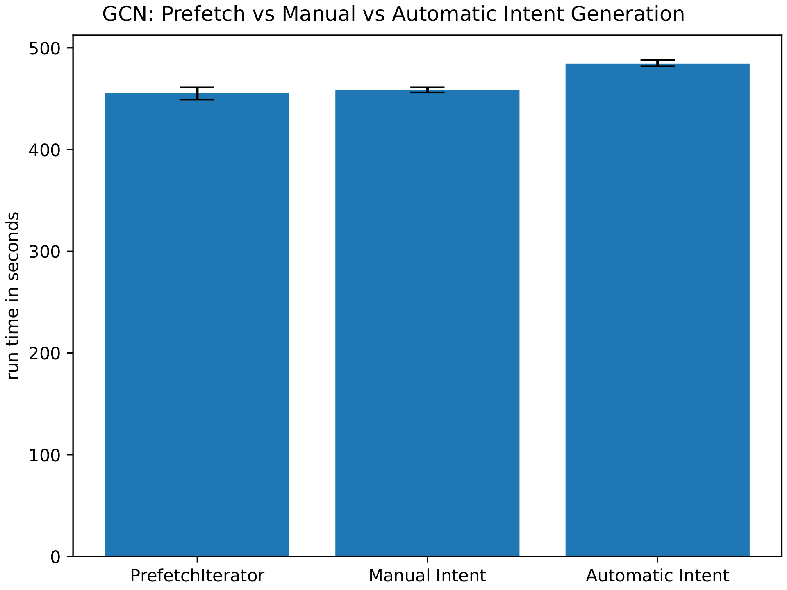
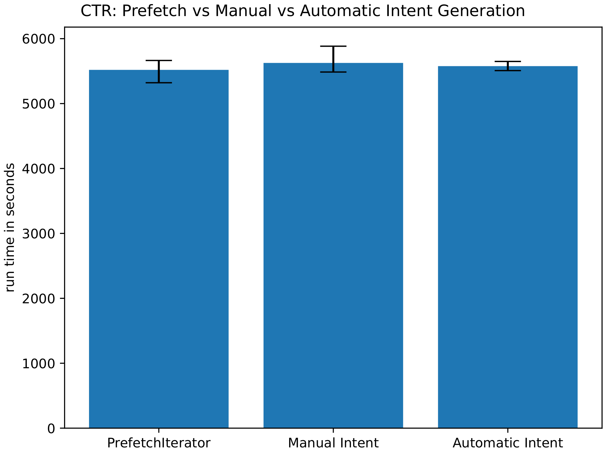

# AutoAda
This repository contains the result of my Master's thesis, _Adaptive Parameter Management in Machine Learning Systems_.
This repository has a big overlap to [AdaPM-PyTorch-apps](https://github.com/alexrenz/AdaPM-PyTorch-apps), to which I contributed as part of my work as a research assistant.
My main system contribution can be found in the ```auto_ada``` folder.
The folders ```ctr``` and ```gcn``` are the AdaPM use-cases ported to regular PyTorch models. 


## Overview & Motivation
Training on AdaPM is faster than on competing backends, but it requires non-trivial modifications to existing codebases. 

Models and training scripts need to be manually adapted for AdaPM.
This requires in-depth knowledge of the model in question, in distributed computing and the underlying mechanisms of AdaPM.
This is a substantial barrier for others to start using this distributed training backend.

The aim of my thesis was to lower or remove those barriers entirely. 
I created _AutoAda_ to automatically transform any PyTorch model, 
and I presented two ways to tackle the non-trivial task of intent signal generation.
The second, AutoAda automatic, **simulates future model parameter accesses efficiently** to derive intent signals (IS), 
which AdaPM depends upon to speed up distributed training.

### Usability comparison
Below is a simple PyTorch training loop, both for standalone AdaPM, and with my thesis result _AutoAda_.

standalone AdaPM:
``` python
"""
beforehand:
Developers need to modify their model manually, 
e.g. by replacing all sparse layers like nn.Embeddings with PSEmbeddings.
"""

def adapm_intent_signaling(data):
    """ write custom code for several model and dataspecific tasks:
        1. Determine parameter access per batch 
            (this requires knowledge what parameters a batch will access in sparse layers)
        2. keep track of AdaPM intent signaling clock
        3. Dispatch adapm intent signals.
    """

def training(dataloader):
    for data in dataloader:
        model.train()
        model.pull()  # triggers parameter synchronization with AdaPM backend.
        adapm_intent_signaling(data)
        res = model(data)
        loss = loss_fn(pred, data[0]) # AdaPM optimizer step is done during backward pass
        adapm.kv.advanceclock()  # triggers AdaPM time keeping
```
AutoAda:
``` python
import autoada as aa

def training(dataloader):
    model =  aa.AdaModel(model)  # automatically transforms model for AdaPM
    dataloader = aa.AdaDataLoader(dataloader) # integrates all manual AdaPM calls
    for data in dataloader:
        model.train()
        res = model(data)
        loss = loss_fn(pred, data[0])
```
As one can see above, AutoAda significantly reduces additional development effort to train on AdaPM.
Users only need to wrap their model and their dataloaders, and my _AutoAda_ system does the rest.
### Capability Overview:

| IS methods/ User requirements | Model Modification | Train script Modification | IS Generation                                 |
|-------------------------------|--------------------|---------------------------|-----------------------------------------------|
| manual IS                     | required           | substantial               | parameter access, access timing, Time keeping |
| AutoAda manual                | automatic          | minimal                   | parameter access only                         | 
| AutoAda automatic             |  automatic     | minimal                   | automatic                                     | 

Compared to the manual IS approach presented in [AdaPM-PyTorch-apps](https://github.com/alexrenz/AdaPM-PyTorch-apps),
my approaches simplify AdaPM use substantially, and any PyTorch model can be trained with AdaPM without additional user effort.

[//]: # (## Architecture)

## Performance
I benchmarked my solutions extensively against the existing manual approaches,
as my solution has to efficiently simulate the future parameter accesses in the forward passes. 
Here, we tested the existing _PrefetchIterator_ against my manual and automatic intent generation.
Each usecase, gcn and ctr, has been run 3 times, and the bars the represent the average runtime. 
The error bars report the minimal and maximal runtime respectively.

A single iteration of gcn required less than 10 minutes on our machine setup. 
Here, our Automatic intent generation performs minimally worse than the other two approaches.

In the CTR use case, all recorded runtimes lie in each others variance. All three approaches perform similarly well.

We can conclude that my automatic intent signaling approach has almost no impact on overall system performance.

# Conclusion
My presented AutoAda approach is general, user-friendly and performant, 
and it presents a viable addition to the AdaPM backend.

